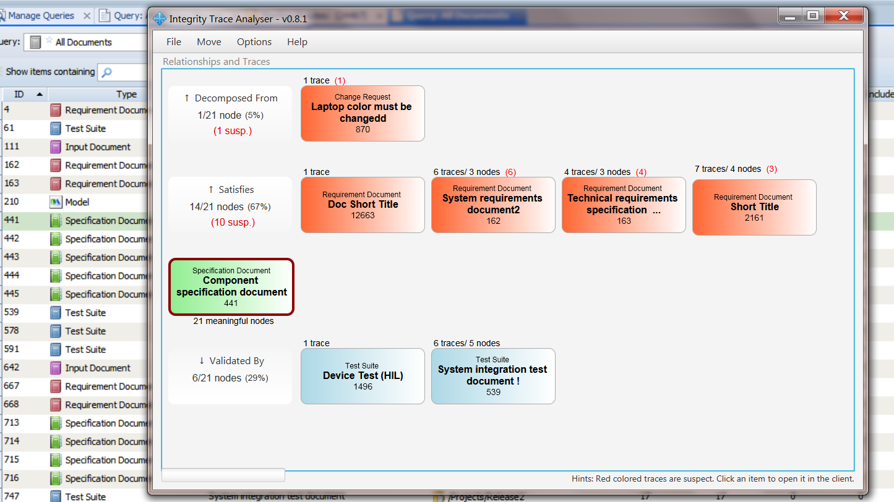

# IntegrityTraceAnalyser
Analyse the traces between your documents 

## Purpose
The TraceAnalyser can be started on a document of your choice. It analyzes which traces you have defined from this document to other documents. It lists upstream as well as existing downstream traces. In addition, it counts all suspect relationships by document.

You can click at one of the document images to open a list of traced nodes for a detailed review. 



## Use Cases
- As a Requirement Manager, I want to have an overview of the Trace Status for my document
- As a Requirement Manager, I want to validate which Documents are exactly traced to the current documents
- As a Requirement Manager, I want to validate the Data Migration of Documents, imported from another Requirement Management System. Especially I want to check the traces imported.

## Install
Option 1: In IntegrityClient folder
- Put the "dist/IntegrityTraceAnalyser.jar" directly into your IntegrityClient folder
- Copy also the files "dist/lib/IntegrityAPI.jar" and "dist/lib/jfxmessagebox-1.1.0.jar" into your IntegrityClient/lib folder
- Add a custom menu entry with:
```
name: Trace Analyser
program:  ../jre/bin/javaw.exe
parameter: -jar ../IntegrityTraceAnalyser.jar
```

Option 2: In a shared folder
- Take all files from "dist" folder and place them somewhere centrally
- Register a custom menu as described before, but with the following change
```
parameter: -jar <your shared folder>/IntegrityTraceAnalyser.jar
```

## How to test
- open any document or just stay on one in the query result
- click Custom > Trace Analyser
- Then review the outcome

##  Development environment
- PTC Integrity LM 10.9 (also 11.0 should be fine)
- Netbeans 7.4 (or 8)
- Java 1.7 (or 1.8)

## Known Limitations
- Will not consider any non-meaningful traces (because not best practice)
- Will not work with Versioned Documents
- Is quite slow when large documents are involved (up to 1 minute to start up with ~ 5000 requirements)
- The colors are internally defined, not configurable
- the progress bar does not work 
